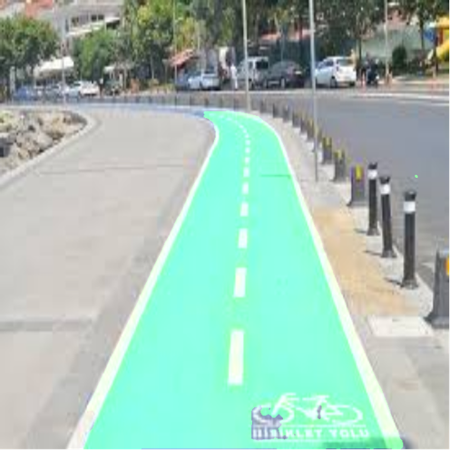
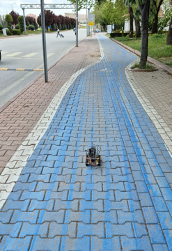
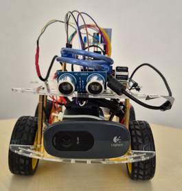
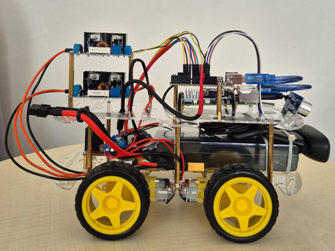

# 🚚 Otonom Kargo Taşıma Aracı

[](https://www.python.org/)
[](https://onnxruntime.ai/)
[](https://opencv.org/)
[](https://www.raspberrypi.com/)
[](LICENSE)

Bu proje; şehir içi lojistik ve taşımacılık süreçlerinde insan iş gücü ihtiyacını azaltmak ve rota hatalarını minimize etmek amacıyla geliştirilmiş, **bisiklet yollarını derin öğrenme tabanlı görüntü işleme algoritmalarıyla anlık segmente ederek takip eden** tam otonom bir taşıyıcı platform prototipidir.

---

## 📌 İçindekiler
- [Projenin Amacı ve Özellikleri](#-projenin-amacı-ve-özellikleri)
- [Sistem ve Yazılım Mimarisi](#-sistem-ve-yazılım-mimarisi)
- [Donanım ve Güç Mimarisi](#-donanım-ve-güç-mimarisi)
- [Algoritma ve Karar Mekanizması](#-algoritma-ve-karar-mekanizması)
- [Kurulum ve Çalıştırma](#-kurulum-ve-çalıştırma)
- [Proje Ekibi ve Danışman](#-proje-ekibi-ve-danışman)

---

## 🎯 Projenin Amacı ve Özellikleri

* **Özgün Veri Seti & Anlamsal Bölütleme:** Sınır kutusu (bounding box) kısıtlamalarını aşmak amacıyla piksel bazlı sınıflandırma yapan **U-Net** mimarisi kullanılmıştır.
* **Uç Cihaz (Edge AI) Optimizasyonu:** Model, Raspberry Pi 5 üzerinde düşük gecikmeyle çalışması için **ONNX** formatına dönüştürülmüştür.
* **Bloklamasız Çoklu İş Parçacığı (Multithreading):** Kamera karesi yakalama, model çıkarımı ve seri port haberleşmesi eşzamanlı olarak yürütülmektedir.
* **İzole Çift Hatlı Güç Mimarisi:** Motorların ani akım çekişlerinden kaynaklanan voltaj düşüşlerinin Raspberry Pi 5'i resetlemesini önleyen elektriksel koruma altyapısı kurulmuştur.

---

## 🧠 Sistem ve Yazılım Mimarisi

### 1. U-Net Semantik Segmentasyon Modeli
Görüntüdeki yol sınırlarını sürekli ve keskin yakalamak için 23 katmanlı daralan (Encoder) ve genişleyen (Decoder) atlamalı bağlantılı U-Net mimarisi eğitilmiştir. Modelin genelleme başarısı **5-Katlamalı Çapraz Doğrulama (5-Fold Cross-Validation)** ile doğrulanmıştır.

| Parametre | Değer / Açıklama |
| :--- | :--- |
| **Giriş Boyutu** | 640x640 / Tek Kanal (Grayscale) |
| **Veri Artırma** | Brightness, Exposure, Rotation, Blur & Noise |
| **Çalışma Ortamı** | ONNX Runtime (Gömülü Sistem Optimizasyonu) |

---

## 🔌 Donanım ve Güç Mimarisi

Sistem, görev dağılımı ilkesiyle iki ana işlemci birimine ayrılmıştır:

* **Raspberry Pi 5 (8 GB RAM):** Üst seviye karar mekanizması, kamera akışı yönetimi, yapay zekâ çıkarımı ve hata tolerans hesabı.
* **Arduino Uno:** Alt seviye donanım kontrolü, HC-SR04 mesafe sensörü okuması ve motor PWM sinyal üretimi.
* **L298N Motor Sürücü & 4x 6V DC Motor:** Tank dönüşü (*skid-steer*) prensibiyle diferansiyel hareket kabiliyeti.
* **Logitech C270 Web Kamerası:** 720p anlık çevresel görüntü akışı.

```text
               ┌────────────────────────────────────────────────────────┐
               │              Jetfire 14.8V 5200 mAh Li-Po Batarya       │
               └───────────────────┬────────────────────────────────┬───┘
                                   │                                │
                                   ▼                                ▼
                    ┌────────────────────────────┐    ┌────────────────────────────┐
                    │ XL4016 Buck Converter #1   │    │ XL4016 Buck Converter #2   │
                    │   (14.8V -> 5.1V Regüle)   │    │   (14.8V -> 9.1V Regüle)   │
                    └──────────────┬─────────────┘    └─────────────┬──────────────┘
                                   │                                │
                                   ▼ (Type-C)                       ▼
                         ┌───────────────────┐            ┌───────────────────┐
                         │  Raspberry Pi 5   │            │  L298N Sürücü &   │
                         │   (8GB LPDDR4X)   │            │    4x DC Motor    │
                         └─────────┬─────────┘            └─────────▲─────────┘
                                   │                                │ (PWM)
                                   │ (USB Serial - UART)            │
                                   ▼                                │
                         ┌──────────────────────────────────────────┴┐
                         │               Arduino Uno                 │
                         │       (HC-SR04 Mesafe Sensörü)            │
                         └───────────────────────────────────────────┘
```

---

## 🔄 Algoritma ve Karar Mekanizması

1. **Görüntü Yakalama:** Kameradan alınan kare normalize edilerek ONNX modeline iletilir.
2. **Maske Üretimi:** Modelden ikili (binary) yol maskesi elde edilir.
3. **Momentum & Ağırlık Merkezi:** OpenCV `moments` fonksiyonları ile yolun geometrik ağırlık merkezi hesaplanır.
4. **Sapma Toleransı:** Kameranın orta ekseni ile yol merkezi arasındaki piksel farkı eşik değeri aşarsa sağa/sola tank dönüşü kararı verilir.
5. **Seri İletim:** Karar komutları USB seri portu üzerinden Arduino Uno'ya aktarılarak motorlar sürülür.

---

## 🚀 Kurulum ve Çalıştırma

### 1. Depoyu Klonlayın
```bash
git clone [https://github.com/kullanici-adiniz/otonom-kargo-araci.git](https://github.com/kullanici-adiniz/otonom-kargo-araci.git)
cd otonom-kargo-araci
```

### 2. Gerekli Python Paketlerini Yükleyin
```bash
pip install -r requirements.txt
```

### 3. Arduino Kodunu Yükleyin
`arduino/motor_and_sensors.ino` dosyasını Arduino IDE üzerinden kartınıza yükleyin.

### 4. Ana Programı Başlatın
```bash
python src/main.py
```

---

## 📸 Canlı Test ve Çıktılar

| Segmentasyon Çıktısı (U-Net) | Sahada Otonom Sürüş Testi |
| :---: | :---: |
|  |  |

| Prototip Önden Görünüm | Prototip Yandan Görünüm |
| :---: | :---: |
|  |  |

---

## 👥 Proje Ekibi ve Danışman

* **Geliştiriciler:** Zeliha Önel & Mevlüt Hoşaf
* **Danışman:** Doç. Dr. Ömer Kaan Baykan
* **Kurum:** Konya Teknik Üniversitesi — Bilgisayar Mühendisliği Bölümü
